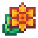

  
  

    <h1 style="margin: 0; color: var(--bloom-accent);">Lupi Nuki</h1>
    Tanuki otimista
    
Curioso, animado e impulsivo. Lupi é um Tanuki com uma paixão por colecionar sementes estranhas e dar nomes criativos a tudo o que vê. Seu coração é tão grande quanto sua energia!

  

  

    <h3>🎨 Caos Criativo</h3>
    
Lupi inventa nomes como "MegaFrutaSolar" e vende tintas que cheiram a morango (por acidente). Ele acredita que um abraço resolve qualquer perigo.

  

  

    <h3>🤝 Relacionamentos</h3>
    <ul>
      <li><strong>Rayy:</strong> Grande amiga e parceira de pintura.</li>
      <li><strong>Milo:</strong> Seu contraponto silencioso. "Eu falo por nós dois!".</li>
    </ul>
  

  <h2>📋 Quest: Chá de Sol</h2>
   Lupi acredita que os girassóis guardam um pouco de sol dentro deles. Ele quer fazer um 'chá de sol' para animar as plantas que ficam dentro de casa.  
  <strong>Objetivos</strong> 
  

  

    <a href="../../items/plants/_items/sunflower/" class="mini-card">
       - Colete 5 Girassóis.
    </a>
  

