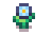

  
  

    <h1 style="margin: 0; color: var(--bloom-accent);">Selene Hawke</h1>
    Elfa Sábia
    
Ex-aventureira e alma do bar de Bloomrise. Selene prefere oferecer carinho a respostas, acreditando que os olhos ouvem melhor que os ouvidos.

  

  <h3>🍵 Sabedoria e Compaixão</h3>
  
Selene atua como mentora para Rayy e tem uma visão profunda sobre Max Rook, entendendo que cicatrizes mentais levam tempo para sarar. Marcus brinca que ela "assusta mais que fogo" quando necessário.

  <h2>📋 Quest: Chá da Serenidade</h2>
   Selene percebeu uma tensão no ar da vila. Para ajudar a acalmar os ânimos, ela quer preparar um chá especial com flores da floresta.  
  <strong>Objetivos</strong> 
  

  

    <a href="../../items/plants/_items/smallblueflower/" class="mini-card">
       - Colete 3 Flores Azuis Pequenas.
    </a>
  

   
  

    <a href="../../items/plants/_items/smallpurpleflower/" class="mini-card">
       - Colete 3 Flores Roxas Pequenas.
    </a>
  

